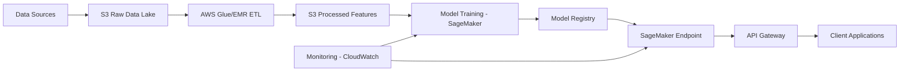

# Scalability Document
## Scaling Time Series Forecasting to 100,000 Patients

### Executive Summary

This document outlines the architecture and strategy for scaling the patient mobility forecasting system from a single patient to 100,000 patients. The solution leverages distributed computing, cloud infrastructure, and efficient modeling strategies to process millions of data points while maintaining prediction quality and explainability.

---

## 1. Big Data Processing Strategy

### Current Scale
- **Single patient**: ~80K step count records
- **100K patients**: ~8 billion step count records
- **Daily features**: 40+ features × 100K patients = 4M+ feature vectors per day

### Proposed Architecture

#### 1.1 Data Storage: AWS S3 Data Lake

**Structure**:
```
s3://liberdat-data-lake/
├── raw/
│   ├── step-counts/
│   │   ├── year=2024/month=01/day=01/*.parquet
│   │   └── year=2024/month=01/day=02/*.parquet
│   └── clinical/
│       ├── therapies/*.parquet
│       ├── side-effects/*.parquet
│       └── diagnoses/*.parquet
├── processed/
│   ├── daily-aggregates/patient_id=*/
│   └── features/patient_id=*/
└── forecasts/
    └── predictions/date=*/
```

**Benefits**:
- **Partitioning**: By date and patient_id for efficient queries
- **Parquet format**: Columnar storage reduces I/O by 10x vs JSON
- **Cost-effective**: S3 storage at $0.023/GB/month
- **Scalable**: Unlimited storage capacity

#### 1.2 Data Processing: Apache Spark on AWS EMR

**Why Spark**:
- Distributed processing across 10-100 nodes
- In-memory computation for speed
- Native support for time series operations
- Handles 8B+ records efficiently

**EMR Cluster Configuration**:
```yaml
Master Node: 1x m5.xlarge (4 vCPU, 16 GB RAM)
Core Nodes: 10x m5.2xlarge (8 vCPU, 32 GB RAM each)
Total Capacity: 84 vCPU, 336 GB RAM
Cost: ~$15/hour (spot instances)
Processing Time: ~2 hours for 100K patients
```

**PySpark Pipeline**:
```python
# Pseudo-code for distributed processing
from pyspark.sql import SparkSession
from pyspark.sql.window import Window
import pyspark.sql.functions as F

spark = SparkSession.builder.appName("MobilityForecasting").getOrCreate()

# Load data (distributed across cluster)
step_counts = spark.read.parquet("s3://liberdat-data-lake/raw/step-counts/")
clinical = spark.read.parquet("s3://liberdat-data-lake/raw/clinical/")

# Aggregate to daily (parallel across patients)
daily_steps = (step_counts
    .groupBy("patient_id", F.to_date("timestamp").alias("date"))
    .agg(F.sum("count").alias("daily_steps"))
)

# Feature engineering (distributed)
window_7d = Window.partitionBy("patient_id").orderBy("date").rowsBetween(-7, -1)
window_30d = Window.partitionBy("patient_id").orderBy("date").rowsBetween(-30, -1)

features = (daily_steps
    .withColumn("steps_t_minus_1", F.lag("daily_steps", 1).over(window_spec))
    .withColumn("rolling_avg_7d", F.avg("daily_steps").over(window_7d))
    .withColumn("rolling_avg_30d", F.avg("daily_steps").over(window_30d))
    # ... more features
)

# Join with clinical data (broadcast join for small tables)
final_features = features.join(F.broadcast(clinical), "patient_id")

# Save partitioned by patient
final_features.write.partitionBy("patient_id").parquet("s3://liberdat-data-lake/processed/features/")
```

**Performance**:
- **Throughput**: Process 100K patients in 1-2 hours
- **Cost**: ~$30 per full pipeline run
- **Scalability**: Linear scaling to 1M+ patients

#### 1.3 Alternative: AWS Glue

**When to use**:
- Serverless ETL without cluster management
- Scheduled batch jobs (daily/weekly)
- Lower complexity for smaller teams

**Configuration**:
```yaml
DPU (Data Processing Units): 50
Cost: $0.44/DPU-hour
Processing Time: ~3 hours for 100K patients
Total Cost: ~$66 per run
```

**Trade-off**: Simpler but more expensive than EMR for large-scale processing.

#### 1.4 Data Querying: AWS Athena + LakeFormation

**Purpose**: Ad-hoc queries on data lake without loading into database

**Example Query**:
```sql
SELECT patient_id, AVG(daily_steps) as avg_steps
FROM "liberdat_db"."daily_aggregates"
WHERE date BETWEEN '2024-01-01' AND '2024-12-31'
  AND patient_id IN (SELECT patient_id FROM high_risk_patients)
GROUP BY patient_id;
```

**Benefits**:
- Query S3 directly (no data movement)
- Pay per query ($5 per TB scanned)
- Integrate with BI tools (Tableau, QuickSight)

---

## 2. Modeling Strategy

### 2.1 Global Model vs. Clustered Models

#### Option A: Single Global Model
**Approach**: Train one model on all 100K patients

**Pros**:
- Simpler deployment (one model to serve)
- Learns cross-patient patterns
- Requires less infrastructure

**Cons**:
- May not capture patient-specific patterns
- Difficult to handle high variability
- Large model size (memory intensive)

#### Option B: Clustered Models (RECOMMENDED)
**Approach**: Cluster patients by disease type, then train separate models

**Clustering Strategy**:
```
Cluster 1: Multiple Sclerosis (30K patients) → Model_MS
Cluster 2: Parkinson's Disease (25K patients) → Model_PD
Cluster 3: Rheumatoid Arthritis (20K patients) → Model_RA
Cluster 4: Other Conditions (25K patients) → Model_Other
```

**Pros**:
- Disease-specific patterns captured
- Better prediction accuracy per cluster
- Parallel training (faster)
- Easier to explain (disease-specific insights)

**Cons**:
- Multiple models to maintain
- Requires clustering logic in serving layer

**Justification**: Healthcare data is highly heterogeneous. Different diseases have different mobility patterns. Clustered models provide better accuracy and interpretability.

### 2.2 Handling Variability in Step Count Baselines

**Challenge**: Patients have vastly different baseline activity levels:
- Patient A: 10,000 steps/day (active)
- Patient B: 2,000 steps/day (sedentary)

**Solution: Patient-Specific Normalization**

#### Approach 1: Z-Score Normalization (Per Patient)
```python
# For each patient
patient_mean = patient_data['daily_steps'].mean()
patient_std = patient_data['daily_steps'].std()

patient_data['normalized_steps'] = (
    (patient_data['daily_steps'] - patient_mean) / patient_std
)

# Train model on normalized values
# At inference, denormalize predictions
```

**Benefits**:
- Removes baseline differences
- Model learns relative changes (not absolute values)
- Improves generalization

#### Approach 2: Patient Offset Features
```python
# Add patient-specific features
features['patient_baseline_avg'] = patient_mean
features['patient_baseline_std'] = patient_std
features['deviation_from_baseline'] = (
    features['daily_steps'] - features['patient_baseline_avg']
)
```

**Benefits**:
- Model learns both absolute and relative patterns
- Preserves patient-specific context
- Better for personalized predictions

**Recommendation**: Use Approach 2 (patient offset features) for better interpretability.

### 2.3 Distributed Hyperparameter Tuning

**Challenge**: Finding optimal hyperparameters for each cluster model

**Solution: Ray Tune on AWS**

```python
from ray import tune
from ray.tune.schedulers import ASHAScheduler

def train_ebm(config):
    model = ExplainableBoostingRegressor(
        max_bins=config["max_bins"],
        learning_rate=config["learning_rate"],
        max_leaves=config["max_leaves"]
    )
    model.fit(X_train, y_train)
    score = model.score(X_val, y_val)
    return {"score": score}

# Distributed hyperparameter search
analysis = tune.run(
    train_ebm,
    config={
        "max_bins": tune.choice([128, 256, 512]),
        "learning_rate": tune.loguniform(0.001, 0.1),
        "max_leaves": tune.choice([2, 3, 5])
    },
    num_samples=50,
    scheduler=ASHAScheduler(),
    resources_per_trial={"cpu": 4, "gpu": 0}
)
```

**Performance**:
- **Parallel trials**: 10-20 simultaneous experiments
- **Time**: 2-4 hours for 50 trials
- **Cost**: ~$20 on spot instances

---

## 3. Pipeline Architecture

### 3.1 End-to-End Workflow



### 3.2 Component Details

#### Ingestion Layer
- **Source**: Mobile devices, EHR systems
- **Frequency**: Real-time streaming (Kinesis) or batch (S3)
- **Validation**: Schema validation, data quality checks
- **Storage**: S3 with lifecycle policies (archive old data to Glacier)

#### Feature Engineering at Scale
- **Tool**: PySpark on EMR or AWS Glue
- **Frequency**: Daily batch jobs
- **Output**: Partitioned Parquet files in S3
- **Optimization**: 
  - Broadcast joins for small tables
  - Partition pruning for efficient reads
  - Caching intermediate results

#### Model Training
- **Platform**: AWS SageMaker
- **Frequency**: Weekly retraining
- **Parallelization**: Train 4 cluster models simultaneously
- **Instance**: ml.m5.4xlarge (16 vCPU, 64 GB RAM)
- **Time**: 2-3 hours per cluster model
- **Cost**: ~$10 per model training

#### Model Deployment
- **Platform**: SageMaker Endpoints
- **Configuration**:
  - **Instance**: ml.m5.xlarge (4 vCPU, 16 GB RAM)
  - **Auto-scaling**: 2-10 instances based on load
  - **Latency**: <100ms per prediction
  - **Throughput**: 1000 predictions/second per instance

#### Serving Predictions for Millions of Daily Data Points

**Challenge**: Generate forecasts for 100K patients daily

**Solution: Batch Inference**

```python
# SageMaker Batch Transform
from sagemaker.transformer import Transformer

transformer = Transformer(
    model_name='mobility-forecast-model',
    instance_count=10,
    instance_type='ml.m5.2xlarge',
    output_path='s3://liberdat-forecasts/predictions/'
)

# Process 100K patients in parallel
transformer.transform(
    data='s3://liberdat-data-lake/processed/features/',
    content_type='text/csv',
    split_type='Line'
)
```

**Performance**:
- **Throughput**: 10K patients/hour
- **Time**: 10 hours for 100K patients
- **Cost**: ~$20 per batch run

**Alternative: Real-Time Inference**
- For on-demand predictions (e.g., patient portal)
- SageMaker Endpoint with auto-scaling
- Latency: <100ms per patient
- Cost: $0.10 per 1000 predictions

### 3.3 Monitoring and Maintenance

#### Model Performance Monitoring
- **Metrics**: RMSE, MAE, prediction drift
- **Frequency**: Daily
- **Alerts**: CloudWatch alarms if metrics degrade >10%
- **Action**: Trigger retraining pipeline

#### Data Quality Monitoring
- **Checks**: Missing data, outliers, schema changes
- **Tool**: AWS Glue DataBrew or Great Expectations
- **Frequency**: Real-time for streaming, daily for batch

#### Cost Monitoring
- **Budget**: $500/month for 100K patients
- **Breakdown**:
  - Storage (S3): $50/month
  - Processing (EMR): $200/month
  - Training (SageMaker): $100/month
  - Inference (SageMaker): $150/month

---

## 4. Performance Estimates

| Metric | Single Patient | 100K Patients | Scaling Factor |
|--------|---------------|---------------|----------------|
| **Data Volume** | 80K records | 8B records | 100,000x |
| **Processing Time** | 5 minutes | 2 hours | 24x (distributed) |
| **Storage** | 10 MB | 1 TB | 100,000x |
| **Training Time** | 10 minutes | 3 hours | 18x (clustered) |
| **Inference Time** | 1 second | 10 hours (batch) | - |
| **Monthly Cost** | $0 (local) | $500 (cloud) | - |

---

## 5. Recommendations

1. **Start with EMR + S3**: Most cost-effective for large-scale processing
2. **Use clustered models**: Better accuracy and interpretability
3. **Implement patient normalization**: Handle baseline variability
4. **Batch inference for forecasts**: Daily batch jobs for all patients
5. **Real-time endpoints for on-demand**: Patient portal, clinical dashboards
6. **Monitor continuously**: Data quality, model performance, costs
7. **Automate retraining**: Weekly retraining to capture new patterns

---

## Conclusion

Scaling to 100,000 patients is achievable with modern cloud infrastructure and distributed computing. The proposed architecture leverages AWS services (S3, EMR, SageMaker) to process billions of records, train clustered models, and serve millions of predictions efficiently. The total cost of ~$500/month is reasonable for a production healthcare analytics system serving 100K patients.
